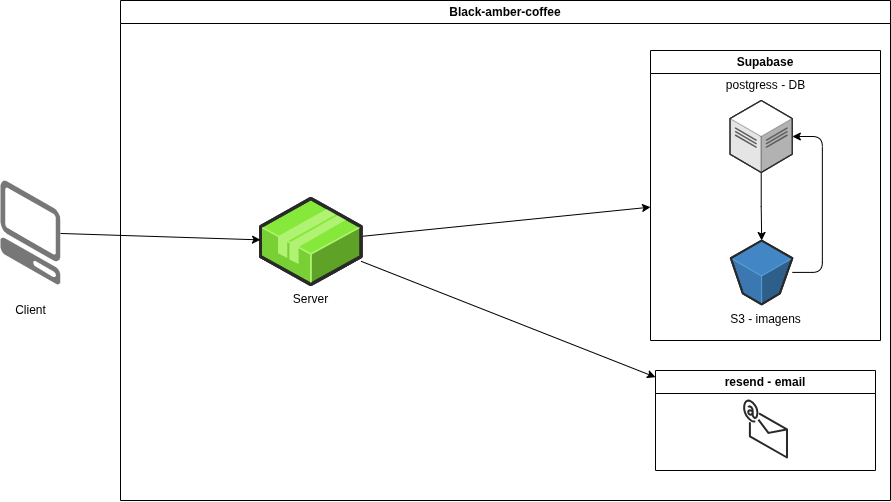

# Black Amber Coffee API

Black Amber Coffee é uma API desenvolvida em Node.js projetada para apoiar as operações de uma cafeteria focada em produtividade. A aplicação fornece uma base robusta para autenticação, monitoramento de integridade (health check), documentação automatizada e gestão de banco de dados.

## Visão Geral

O projeto foi construído utilizando TypeScript, Express e Drizzle ORM, contando com documentação interativa via Swagger. A arquitetura segue uma abordagem modular para facilitar a evolução e a implementação de novas regras de negócio, como gerenciamento de usuários, processamento de pedidos, pagamentos e operações internas. A base também integra recursos para envio de e-mails, processamento de imagens e armazenamento em nuvem.

## Tecnologias

- **Core**: Node.js, Express, TypeScript
- **Banco de Dados e ORM**: PostgreSQL, Drizzle ORM
- **Segurança e Validação**: JWT, Bcrypt, Zod
- **Documentação**: Swagger
- **Integrações e Ferramentas**: AWS S3, Resend, React Email, Sharp, Multer, Pino (Logging)

## Arquitetura

A estrutura de diretórios foi organizada da seguinte forma:



```text
src/
  config/    Configurações de ambiente e de banco de dados
  core/      Regras de negócio centrais e utilitários compartilhados
  db/        Definição de schemas e integração com o banco de dados
  modules/   Módulos de domínio segregados por funcionalidade
  routes/    Definição do roteamento da API
  shared/    Enums, tipagens e utilitários comuns
```

### Módulos Atuais

- `health`: Endpoint responsável por verificar a disponibilidade da aplicação.
- `auth`: Estrutura base preparada para autenticação e autorização de usuários.

## Primeiros Passos

### Pré-requisitos

- Node.js
- PostgreSQL
- Docker e Docker Compose (opcional, para execução isolada em containers)

### Instalação

Após clonar o repositório, instale as dependências do projeto:

```bash
npm install
```

### Variáveis de Ambiente

Crie um arquivo `.env` na raiz do repositório contendo as variáveis necessárias para o funcionamento do ambiente (ex.: URL do banco de dados, chaves secretas para o JWT e credenciais de serviços externos).

### Executando a Aplicação

Utilize os comandos abaixo para gerenciar a aplicação:

- **Iniciar a API:**
  ```bash
  npm run start
  ```
- **Compilar o projeto (TypeScript):**
  ```bash
  npm run build
  ```
- **Iniciar infraestrutura via Docker:**
  ```bash
  npm run docker-up
  ```
- **Encerrar infraestrutura via Docker:**
  ```bash
  npm run docker-down
  ```

## Banco de Dados

O projeto utiliza o Drizzle ORM para a modelagem e controle de migrações do PostgreSQL, assegurando que o schema do banco permaneça centralizado e versionado junto ao código da aplicação.

### Migrações

- **Gerar uma nova migração (após alterar schemas):**
  ```bash
  npm run migrate-new
  ```
- **Aplicar as migrações pendentes no banco de dados:**
  ```bash
  npm run migrate-up
  ```

_(Nota: Os scripts `db:delete` e `db:reset` presentes no `package.json` são utilitários legados de uma implementação anterior com SQLite e não devem ser utilizados no ambiente atual com PostgreSQL)._

## Documentação

A documentação interativa da API foi elaborada via Swagger. Com a aplicação em execução, a interface pode ser acessada através da seguinte rota:

- `GET /docs`

## Licença

Este projeto está licenciado sob os termos da licença MIT. Para mais detalhes, consulte o arquivo [LICENSE](./LICENSE).
